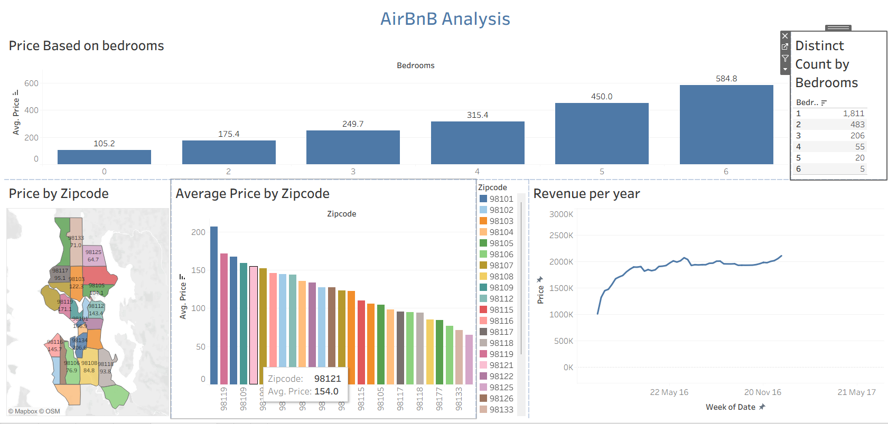

# Seattle AirBnB Analysis - Tableau Dashboard

## Project Overview
This project provides a comprehensive analysis of the AirBnB market in Seattle. Using a dataset of thousands of listings, I built an interactive dashboard to help stakeholders understand pricing trends, geographic hotspots, and revenue patterns based on property size.

## 📊 Live Dashboard
[**Click here to view the interactive dashboard on Tableau Public**](https://public.tableau.com/views/AirBnBFullproject_17722931722550/Dashboard1?:language=en-US&publish=yes&:sid=&:redirect=auth&:display_count=n&:origin=viz_share_link)

## Key Features & Visualizations
* **Geographic Price Map:** An interactive map of Seattle zip codes showing where the most expensive listings are located.
* **Average Price per Bedroom:** A bar chart visualizing the price scaling from 1 to 6+ bedrooms.
* **Distinct Listing Count:** A metric showing the total volume of available properties.
* **Revenue Trend (2016):** A time-series line chart showing how prices fluctuated throughout the year, identifying peak seasons.
* **Full Interactivity:** The dashboard uses the map as a filter, allowing users to click a specific zip code to update all other charts instantly.

## Tools Used
* **Tableau Public:** Data Visualization & Dashboarding
* **Excel:** Initial data inspection and structuring

## Dashboard Preview

## About Me
I am an aspiring Data Analyst with a background in Electrical and Electronics Engineering. I have completed projects across the full data stack, including **SQL** (Data Cleaning), **Excel** (Advanced Reporting), **Power BI**, and now **Tableau**.
